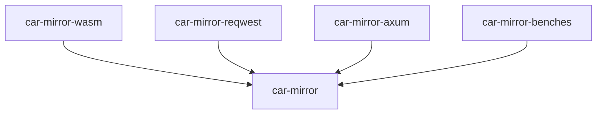

<div align="center">
  <a href="https://github.com/fission-codes/rs-car-mirror" target="_blank">
    </img>
  </a>

  <h1 align="center">car-mirror</h1>

  <p>
    <a href="https://crates.io/crates/car-mirror">
      
    </a>
    <a href="https://npmjs.com/package/car-mirror">
      
    </a>
    <a href="https://codecov.io/gh/fission-codes/rs-car-mirror">
      
    </a>
    <a href="https://github.com/fission-codes/rs-car-mirror/actions?query=">
      
    </a>
    <a href="https://github.com/fission-codes/rs-car-mirror/blob/main/LICENSE-APACHE">
      
    </a>
    <a href="https://github.com/fission-codes/rs-car-mirror/blob/main/LICENSE-MIT">
      
    </a>
    <a href="https://docs.rs/car-mirror">
      
    </a>
    <a href="https://discord.com/invite/zAQBDEq">
      
    </a>
  </p>
</div>

<div align="center"><sub>:warning: Work in progress :warning:</sub></div>

## rs-car-mirror

A rust implementation of the [car mirror protocol] that can be compiled to Wasm to run in the browser.
Car mirror is used to transfer [IPLD] from one computer to another over the internet over various transports,
but most notably HTTP(s).
It tries to do so with deduplication and minimal communcation round-trips.

The main storage abstraction that rs-car-mirror is built upon is a [`BlockStore`] implementation from the [`wnfs-common` crate].

## Outline

- [Crates](#crates)
- [Usage and Installation](#usage-and-installation)
- [Testing the Project](#testing-the-project)
- [Benchmarking the Project](#benchmarking-the-project)
- [Setting-up car-mirror-wasm](#setting-up-car-mirror-wasm)
- [Contributing](#contributing)
- [Getting Help](#getting-help)
- [External Resources](#external-resources)
- [License](#license)

## Crates

- [car-mirror](https://github.com/fission-codes/rs-car-mirror/tree/main/car-mirror): The [sans-io] implementation of the car mirror protocol
- [car-mirror-axum](https://github.com/fission-codes/rs-car-mirror/tree/main/car-mirror-axum): Utilities for and an implementation of a car mirror HTTP server.
- [car-mirror-reqwest](https://github.com/fission-codes/rs-car-mirror/tree/main/car-mirror-reqwest): Utilities for running car mirror protocol requests against a car mirror HTTP server.
- [car-mirror-wasm](https://github.com/fission-codes/rs-car-mirror/tree/main/car-mirror-wasm): (Browser-flavoured) Wasm bindings to the client parts of car-mirror.
- [car-mirror-benches](https://github.com/fission-codes/rs-car-mirror/tree/main/car-mirror-benches): Benchmarks. Not a published crate.

This is the dependency graph between these crates:


## Usage and Installation

### Usage

This is an example of running both a local car-mirror axum server with some test data as well as running requests against it using car-mirror-reqwest:

```rs
use anyhow::Result;
use car_mirror::{cache::NoCache, common::Config};
use car_mirror_reqwest::RequestBuilderExt;
use reqwest::Client;
use wnfs_common::{BlockStore, MemoryBlockStore, CODEC_RAW};

#[tokio::main]
async fn main() -> Result<()> {
    // Start a car-mirror axum webserver:
    tokio::spawn(car_mirror_axum::serve(MemoryBlockStore::new()));

    // Generate some test IPLD data:
    let store = MemoryBlockStore::new();
    let data = b"Hello, world!".to_vec();
    let root = store.put_block(data, CODEC_RAW).await?;

    // Run the car mirror push protocol to upload the IPLD data:
    let client = Client::new();
    client
        .post(format!("http://localhost:3344/dag/push/{root}"))
        .run_car_mirror_push(root, &store, &NoCache)
        .await?;

    let store = MemoryBlockStore::new(); // clear out data
    // Download the same data again:
    client
        .post(format!("http://localhost:3344/dag/pull/{root}"))
        .run_car_mirror_pull(root, &Config::default(), &store, &NoCache)
        .await?;

    assert!(store.has_block(&root).await?);
    Ok(())
}
```

### In a rust project

- `cargo add car-mirror-reqwest` if you want to do client requests with the `reqwest` crate against a car-mirror server over HTTP.
- `cargo add car-mirror-axum` if you want to implement an `axum` version `0.7` server to serve data via car-mirror over HTTP.
- `cargo add car-mirror` as a lower-level library for clients/servers/peers that want to talk car-mirror over other protocol types.

### In a javascript project

`npm i car-mirror-wasm`

This monorepo contains the `car-mirror-wasm` bindings to the client parts of `car-mirror`.
These bindings are really low-level and only have rudimentary typescript types.
Take a look at the [test utilities](https://github.com/fission-codes/rs-car-mirror/blob/98db580ce8a155d8b20d20f728f22611b72feb36/car-mirror-wasm/test/index.js) to see how to use the low-level functions together with e.g. the `fetch` API.

## Testing the Project

- Run tests for the whole workspace:

  ```console
  cargo test
  ```

  Or just the `car-mirror` crate:

  ```console
  cargo test -p car-mirror
  ```

- To test `car-mirror-wasm`:

  ```console
  cd car-mirror-wasm && npm test
  ```

## Benchmarking the Project

For benchmarking and measuring performance, this workspaces provides
a Rust-specific benchmarking package leveraging [criterion][criterion] and a
`test_utils` feature flag for integrating [proptest][proptest] within the
suite for working with [strategies][strategies] and sampling from randomly
generated values.

- Run benchmarks

  ```console
  cargo bench -p car-mirror-benches
  ```

*Note*: Currently, this workspace only supports Rust-native benchmarking, as
`wasm-bindgen` support for criterion is still [an open issue][criterion-bindgen].
However, with some extra work, benchmarks can be compiled to [wasi][wasi] and
run with [wasmer][wasmer]/[wasmtime][wasmtime] or in the brower with
[webassembly.sh][wasmsh]. Please catch-up with wasm support for criterion on their
[user-guide][criterion-user-guide].

## Contributing

:balloon: We're thankful for any feedback and help in improving our project!
We have a [contributing guide](./CONTRIBUTING.md) to help you get involved. We
also adhere to our [Code of Conduct](./CODE_OF_CONDUCT.md).

### Nix

This repository contains a [Nix flake][nix-flake] that initiates both the Rust
toolchain set in [rust-toolchain.toml](./rust-toolchain.toml) and a
[pre-commit hook](#pre-commit-hook). It also installs helpful cargo binaries for
development. Please install [nix][nix] and [direnv][direnv] to get started.

Run `nix develop` or `direnv allow` to load the `devShell` flake output,
according to your preference.

### Formatting

For formatting Rust in particular, we automatically format on `nightly`, as it
uses specific nightly features we recommend by default.

### Pre-commit Hook

This library recommends using [pre-commit][pre-commit] for running pre-commit
hooks. Please run this before every commit and/or push.

- If you are doing interim commits locally, and for some reason if you _don't_
  want pre-commit hooks to fire, you can run
  `git commit -a -m "Your message here" --no-verify`.

### Recommended Development Flow

- We recommend leveraging [cargo-watch],
  [cargo-expand] and [irust] for Rust development.
- We recommend using [cargo-udeps] for removing unused dependencies
  before commits and pull-requests.

### Conventional Commits

This project *lightly* follows the [Conventional Commits
convention][commit-spec-site] to help explain
commit history and tie in with our release process. The full specification
can be found [here][commit-spec]. We recommend prefixing your commits with
a type of `fix`, `feat`, `docs`, `ci`, `refactor`, etc..., structured like so:

```
<type>[optional scope]: <description>

[optional body]

[optional footer(s)]
```

## Getting Help

For usage questions, usecases, or issues reach out to us in our [Discord channel](https://discord.com/invite/zAQBDEq).

We would be happy to try to answer your question or try opening a new issue on Github.

## External Resources

These are references to specifications, talks and presentations, etc.

## License

This project is licensed under either of

- Apache License, Version 2.0, ([LICENSE-APACHE](./LICENSE-APACHE) or [http://www.apache.org/licenses/LICENSE-2.0][apache])
- MIT license ([LICENSE-MIT](./LICENSE-MIT) or [http://opensource.org/licenses/MIT][mit])

at your option.

### Contribution

Unless you explicitly state otherwise, any contribution intentionally
submitted for inclusion in the work by you, as defined in the Apache-2.0
license, shall be dual licensed as above, without any additional terms or
conditions.


[apache]: https://www.apache.org/licenses/LICENSE-2.0
[cargo-expand]: https://github.com/dtolnay/cargo-expand
[cargo-udeps]: https://github.com/est31/cargo-udeps
[cargo-watch]: https://github.com/watchexec/cargo-watch
[commit-spec]: https://www.conventionalcommits.org/en/v1.0.0/#specification
[commit-spec-site]: https://www.conventionalcommits.org/
[criterion]: https://github.com/bheisler/criterion.rs
[criterion-bindgen]: https://github.com/bheisler/criterion.rs/issues/270
[criterion-user-guide]: https://github.com/bheisler/criterion.rs/blob/version-0.4/book/src/user_guide/wasi.md
[direnv]:https://direnv.net/
[irust]: https://github.com/sigmaSd/IRust
[mit]: http://opensource.org/licenses/MIT
[nix]:https://nixos.org/download.html
[nix-flake]: https://nixos.wiki/wiki/Flakes
[pre-commit]: https://pre-commit.com/
[proptest]: https://github.com/proptest-rs/proptest
[strategies]: https://docs.rs/proptest/latest/proptest/strategy/trait.Strategy.html
[wasi]: https://wasi.dev/
[wasmer]: https://wasmer.io/
[wasmtime]: https://docs.wasmtime.dev/
[wasmsh]: https://webassembly.sh/
[wasm-bindgen]: https://github.com/rustwasm/wasm-bindgen
[car mirror protocol]: https://github.com/wnfs-wg/car-mirror-spec
[IPLD]: https://ipld.io
[sans-io]: https://release-plz.ieni.dev/docs/usage/installation
[`BlockStore`]: https://docs.rs/wnfs-common/latest/wnfs_common/blockstore/trait.BlockStore.html
[`wnfs-common` crate]: https://docs.rs/wnfs-common/latest/wnfs_common/
